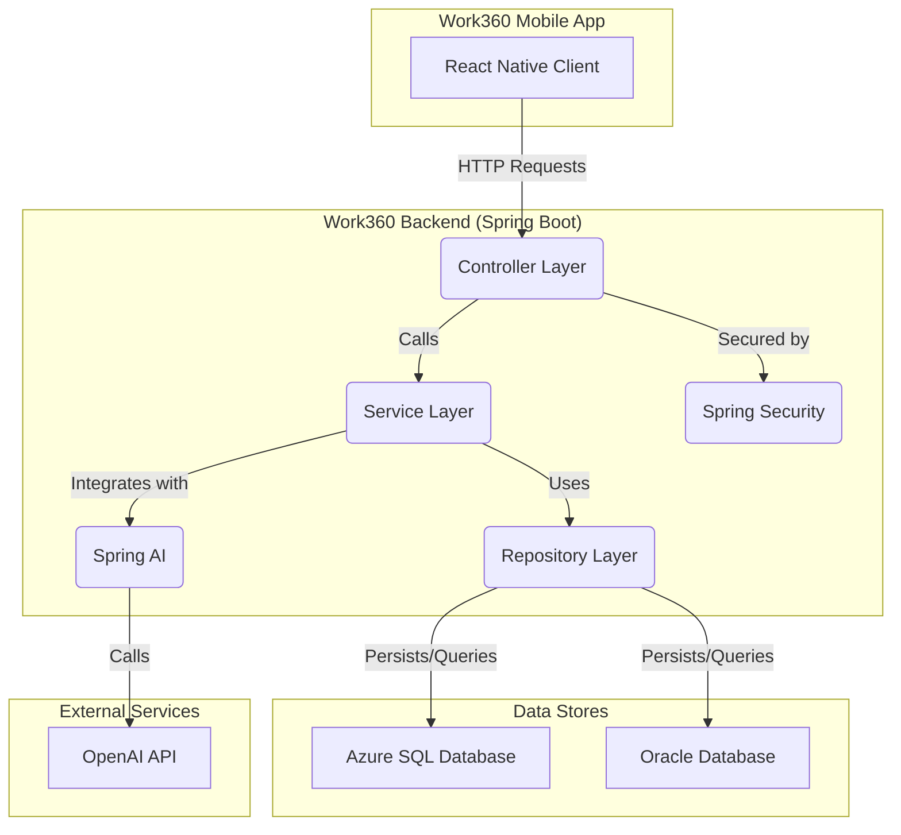

# 🚀 Global Solution: Work360 - API Backend (Java)

Bem-vindo ao repositório do backend da solução Work360. Esta API, construída com **Java e Spring Boot**, é o cérebro por trás do aplicativo móvel, fornecendo todos os dados, lógica de negócio e poder de processamento necessários para uma gestão de produtividade inteligente e centralizada.

A API é responsável por:
- Gerenciar usuários, tarefas e reuniões.
- Proteger os dados com autenticação baseada em JWT.
- Coletar e processar eventos de analytics.
- Integrar-se com a API da OpenAI para gerar insights de produtividade com Inteligência Artificial.

[](https://www.java.com)
[](https://spring.io/projects/spring-boot)
[](https://gradle.org)
[](https://hibernate.org/)
[](https://azure.microsoft.com/en-us/products/azure-sql/database/)
[](https://www.oracle.com/database/)

### 👨‍💻 Integrantes

1.  **Eduardo Henrique Strapazzon Nagado** - RM558158
2.  **Felipe Silva Maciel** - RM555307
3.  **Gustavo Ramires Lazzuri** - RM556772

---

## ✨ Funcionalidades do Backend

Esta API fornece os seguintes endpoints e funcionalidades para o cliente móvel:

-   🔐 **Autenticação e Segurança (Spring Security & JWT)**:
    -   Endpoints `/login` e `/registrar` para gerenciamento de usuários.
    -   Geração de tokens JWT na autenticação para proteger as rotas da API.
    -   Validação de token em cada requisição para garantir o acesso seguro aos recursos do usuário.

-   ✅ **Gestão de Tarefas**:
    -   Operações **CRUD** completas (`GET`, `POST`, `PUT`, `DELETE`) para as tarefas de um usuário.
    -   Endpoints para listar tarefas com filtros (pendentes, concluídas, por prioridade).

-   📅 **Agendamento de Reuniões**:
    -   Operações **CRUD** completas para agendamento e gerenciamento de reuniões.
    -   Lógica para separar reuniões em "Próximas" e "Passadas" com base na data atual.

-   ⚡ **Analytics do Modo Foco**:
    -   Endpoint para receber e registrar eventos de início e fim de sessões de foco (`FOCO_INICIO`, `FOCO_FIM`).
    -   Os dados são armazenados para alimentar os relatórios de produtividade.

-   🤖 **Relatórios com Inteligência Artificial (Spring AI)**:
    -   Endpoint para gerar relatórios de produtividade com base em um período de tempo.
    -   Funcionalidade para "enriquecer" um relatório existente, que se conecta à **API da OpenAI (GPT-4o-mini)**.
    -   A IA analisa os dados de produtividade (tarefas, foco) e gera `insights`, `resumoGeral` e `recomendacaoIA`, que são salvos no banco de dados e retornados ao usuário.

---

## 🏗️ Arquitetura da API

A aplicação segue uma arquitetura em camadas, promovendo a separação de responsabilidades, testabilidade e manutenibilidade. A estrutura de banco de dados é híbrida, utilizando o melhor de cada tecnologia para diferentes propósitos.



### Detalhes da Arquitetura

1.  **Controller Layer (`@RestController`)**: Expõe os endpoints da API REST. É responsável por receber as requisições HTTP, validar os dados de entrada (DTOs) e delegar a lógica de negócio para a camada de serviço.

2.  **Service Layer (`@Service`)**: Contém a lógica de negócio principal da aplicação. Orquestra as chamadas aos repositórios e a outros serviços (como o Spring AI) para cumprir as solicitações.

3.  **Repository Layer (`@Repository` & Spring Data JPA)**: Camada de acesso a dados. As interfaces que estendem `JpaRepository` abstraem a complexidade das operações de banco de dados.

4.  **Banco de Dados Híbrido**:
    -   **Azure SQL Server**: Utilizado como o banco de dados principal para as operações transacionais do dia a dia (CRUD de usuários, tarefas, reuniões).
    -   **Oracle Database**: Utilizado como banco de dados secundário, com foco em analytics e geração de relatórios complexos.

5.  **Segurança (Spring Security)**: Um filtro de segurança intercepta todas as requisições, valida o token JWT e garante que apenas usuários autenticados e autorizados acessem os recursos protegidos.

6.  **Inteligência Artificial (Spring AI)**: Abstrai a comunicação com a API da OpenAI, facilitando a geração de texto e análises inteligentes diretamente da camada de serviço.

---

## 🛠️ Tecnologias Utilizadas

-   **Linguagem**: Java 17
-   **Framework**: Spring Boot 3.3
-   **Build Tool**: Gradle
-   **Acesso a Dados**: Spring Data JPA, Hibernate
-   **Bancos de Dados**:
    -   Microsoft Azure SQL Server (Primário)
    -   Oracle Database (Secundário/Relatórios)
-   **Segurança**: Spring Security, JSON Web Tokens (JWT)
-   **Inteligência Artificial**: Spring AI (com integração OpenAI)
-   **Documentação da API**: SpringDoc (Swagger UI)

---

## 🚀 Como Executar

### Pré-requisitos

-   JDK 17 ou superior.
-   Acesso a uma instância do Azure SQL Server e Oracle Database.
-   Uma chave de API da OpenAI.

### Configuração

1.  **Clone o repositório:**
    ```bash
    git clone https://github.com/seu-usuario/work360_java.git
    cd work360_java
    ```

2.  **Configure as variáveis de ambiente:**
    A aplicação é configurada via variáveis de ambiente para manter as credenciais seguras. Crie um arquivo `.env` na raiz do projeto ou configure as variáveis no seu sistema operacional/IDE.

    ```properties
    # 1. CONFIGURAÇÃO AZURE
    DB_AZURE_URL="jdbc:sqlserver://seu-servidor.database.windows.net:1433;..."
    DB_AZURE_USER="seu_usuario"
    DB_AZURE_PASS="sua_senha"

    # 2. CONFIGURAÇÃO ORACLE
    DB_ORACLE_URL="jdbc:oracle:thin:@seu-host:1521:ORCL"
    DB_ORACLE_USER="seu_usuario"
    DB_ORACLE_PASS="sua_senha"

    # 5. Spring AI
    SPRING_AI_OPENAI_API_KEY="sk-..."

    # 6. SEGURANÇA (JWT)
    API_SECURITY_TOKEN_SECRET="sua_chave_secreta_super_longa_e_segura_aqui"
    ```
    *Consulte o arquivo `src/main/resources/application.properties` para ver os nomes exatos das variáveis esperadas.*

### Execução

1.  **Execute a aplicação usando o Gradle Wrapper:**
    ```bash
    # No Windows
    ./gradlew.bat bootRun

    # No Linux/macOS
    ./gradlew bootRun
    ```

2.  **Acesse a documentação da API:**
    Após a inicialização, a documentação interativa do Swagger UI estará disponível em:
    http://localhost:8080/swagger-ui.html

---